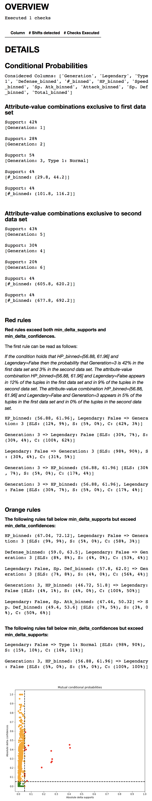

.. _conditional_probabilities:

Conditional Probabilities
=========================

Description
-----------

This check uses conditional probabilities to compare your data sets.
It produces a comprehensive and comprehensible overview of the
differences in the value distributions of your data sets.

As :ref:`conditional_probabilities` performs exact matching, it works best
with data sets consisting of categorical columns only. A pre-processing
step is included to transform continuous to categorical columns.

The result not only shows you if a shift happened. It also shows you where
and to what extent your data sets differ from each other.

Example
-------

This section shows you how to use :ref:`conditional_probabilities` and interpret
its result.

Code
++++

::

    from shift_detector.Detector import Detector
    from shift_detector.checks.ConditionalProbabilitiesCheck import ConditionalProbabilitiesCheck

    data_set_1 = 'examples/shoes_first.csv'
    data_set_2 = 'examples/shoes_second.csv'

    detector = Detector(
        data_set_1,
        data_set_2,
        delimiter=','
    )
    detector.run(
        ConditionalProbabilitiesCheck()
    )
    detector.evaluate()

The code works as follows:

1. First, you create a :class:`~shift_detector.Detector.Detector` object to tell Morpheus
   which data sets you want to compare.
2. Then, you specify in :meth:`~shift_detector.Detector.Detector.run`
   which check you want to run: in this case
   :class:`~shift_detector.checks.ConditionalProbabilitiesCheck.ConditionalProbabilitiesCheck`.
3. Finally, you print the result with :meth:`~shift_detector.Detector.Detector.evaluate`.

Result
++++++

:ref:`conditional_probabilities` produces a set of so called rule clusters::

    [make: Nike, color: black, category: football]
    make: Nike, color: black ==> category: football [SLS: (30%, 7%), S: (3%, 5%), C: (10%, 71%)]
    delta_support: 2%, number of sub-rules: 13
    ...

Interpretation
++++++++++++++

The above rule can be read as follows:

1. 30% of the tuples in ``data_set_1`` and 7% of the tuples in ``data_set_2``
   are about black Nike shoes. This accounts to a difference of 23%.
2. 3% of the tuples in ``data_set_1`` and 5% of the tuples in ``data_set_2``
   are about black Nike football shoes. This accounts to a difference of -2%.
3. If a tuple is about black Nike shoes the conditional probability that
   the category is football is 10% in ``data_set_1`` and 71% in ``data_set_2``.
   This accounts to a difference of -61%.

This tells you that:

1. ``data_set_1`` contains way more tuples about black Nike shoes than
   ``data_set_2``, however,
2. the probability that a black Nike shoe is made for football is way higher
   in ``data_set_2`` than in ``data_set_1``.

.. _conditional_probabilities_parameters:

Parameters
----------

:ref:`conditional_probabilities` provides several tuning knobs and adjustable
thresholds that control (a) the computational complexity and
(b) the size of the result:

``min_support``:
    This parameter expects a float between 0 and 1 and impacts both runtime
    and size of the result. :ref:`conditional_probabilities` only produces
    rules whose ``support_of_left_side`` and ``support`` exceed ``min_support``
    in at least one of the two data sets.

    The lower you choose ``min_support`` the more resources are required
    both in terms of memory and CPU.
    The default value is 0.01. This means that :ref:`conditional_probabilities`
    only considers values which appear in at least 1% of your tuples.
    By adjusting this parameter you can adjust the granularity of the comparison
    of the two data sets.

``min_confidence``:
    This parameter expects a float between 0 and 1 and impacts the size of the
    result. :ref:`conditional_probabilities` only produces rules whose
    ``confidence`` exceeds ``min_confidence`` in at least one of the two data sets.

    The lower you choose ``min_confidence`` the more rules are generated.
    The default value is 0.15. This means that the conditional probability
    of a right side given a left side has to be at least 15%.

``rule_limit``:
	This parameter expects an int and controls the maximum number of rules that are
	printed as a result of executing :ref:`conditional_probabilities`.
	The default value is 5. This means that the 5 most significant rules are printed.

``min_delta_supports``:
	This parameter expects a float between 0 and 1 and affects the granularity of the
	comparison of the two data sets. Only rules whose support values exhibit an absolute
	difference of more than ``min_delta_supports`` are considered during computation.
	The default value is 0.05.

``min_delta_confidences``:
	This parameter expects a float between 0 and 1 and affects the granularity of the
	comparison of the two data sets. Only rules whose confidence values exhibit an absolute
	difference of more than ``min_delta_confidences`` are considered during computation.
	The default value is 0.05.

Please keep in mind that a rule has to satisfy **all** of the requirements above
to appear in the result.

Implementation
--------------

Algorithm
+++++++++

:ref:`conditional_probabilities` proceeds in two phases:

Rule Computation
################

In the first phase,

1. Both data sets are transformed: each component of every tuple is replaced
   by an attribute-name, attribute-value pair. However, this transformation is
   applied on the fly; we never actually copy the data.
2. The FP-growth algorithm is used to generate *association rules* for both
   data sets. The parameters ``min_support`` and
   ``min_confidence`` are used as described in [Han2000]_ and
   [Agrawal1994]_. The only difference is that both parameters are relative and
   expect ``floats`` between 0 and 1, whereas [Han2000]_ and [Agrawal1994]_
   use an absolute value for ``min_support``.
3. Association rules exceeding ``min_support`` and ``min_confidence`` in both
   data sets can be compared directly. For each of those rule-pairs generate an
   intermediate result rule similar to the form showed above.
4. If a rule exceeds ``min_support`` and ``min_confidence`` in
   one data set but not in the other, we don't know if this rule does not appear in
   the other data set at all or just does not exceed ``min_support`` and/or
   ``min_confidence``. We therefore scan both data sets one
   more time and count their appearances. This information at hand, we can
   generate the remaining intermediate result rules.
5. The intermediate result rules are filtered for those exceeding
   ``min_delta_supports`` and ``min_delta_confidences``.

Rule Compression
################

The second phase

References
----------

.. [Han2000] Jiawei Han, Jian Pei, and Yiwen Yin. 2000. Mining frequent patterns
   without candidate generation. In Proceedings of the 2000 ACM SIGMOD international
   conference on Management of data (SIGMOD '00). ACM, New York, NY, USA, 1-12
.. [Agrawal1994] Rakesh Agrawal and Ramakrishnan Srikant. 1994. Fast Algorithms for
   Mining Association Rules in Large Databases. In Proceedings of the 20th
   International Conference on Very Large Data Bases (VLDB '94), Jorge B. Bocca,
   Matthias Jarke, and Carlo Zaniolo (Eds.). Morgan Kaufmann Publishers Inc., San
   Francisco, CA, USA, 487-499.