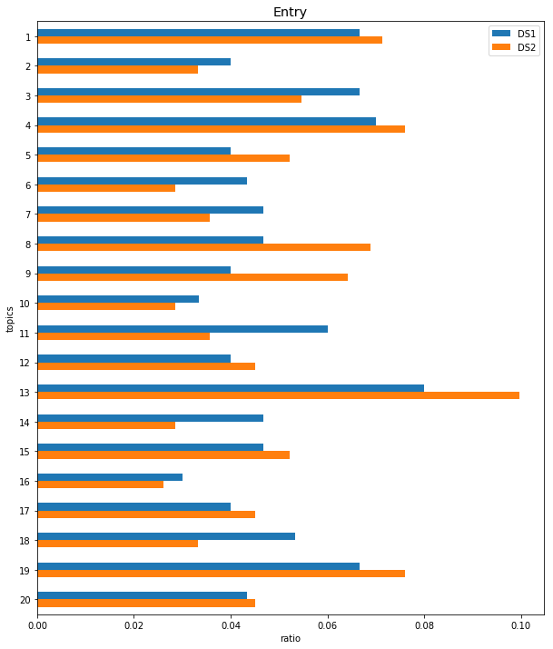

.. _guide:

LDA
====================

Description
-----------

This check uses Latent Dirichlet Allocation [Blei2001]_ or LDA to compare the textual
columns of two datasets. Given a number of topics it compares how often each topic
occurs in either dataset and alerts the user if the percentual difference in topic
occurrences exceeds a shift_threshold.

This check is only applicable on textual data.

If there are one or more detected shifts in the topics of the two dataset,
the user can conclude that certain themes/topics seem to have increased or
decreased enough to impact performance if used as training data for the same
machine learning model.

Example
-------

This section shows you how to use :ref:`LdaCheck` and interpret its result.

Code
++++

::

    from shift_detector.detector import Detector
    from shift_detector.checks.lda_check import LdaCheck

    df1 = 'data/pokedex1.csv'
    df2 = 'data/pokedex2.csv'

    detector = Detector(df1, df2)
    detector.run(LdaCheck(cols=['Entry'], shift_threshold=0.01))
    detector.evaluate()

1. First, you create a :class:`~shift_detector.detector.Detector` object to tell Morpheus
   which data sets you want to compare.
2. Then, you specify in :meth:`~shift_detector.detector.Detector.run`
   which check you want to run: in this case
   :class:`~shift_detector.checks.lda_check.LdaCheck`.
3. Finally, you print the result with :meth:`~shift_detector.detector.Detector.evaluate`.

Result
++++++

::

    LDA Check
    Examined Columns: ['Entry']
    Shifted Columns: ['Entry']

    Column 'Entry has a diff in topic 1 of ':
        0.01
    Column 'Entry has a diff in topic 2 of ':
        -0.015
    Column 'Entry has a diff in topic 4 of ':
        0.012
    Column 'Entry has a diff in topic 9 of ':
        0.019
    Column 'Entry has a diff in topic 11 of ':
        0.021
    Column 'Entry has a diff in topic 13 of ':
        0.016
    Column 'Entry has a diff in topic 16 of ':
        0.02
    Column 'Entry has a diff in topic 17 of ':
        -0.019
    Column 'Entry has a diff in topic 18 of ':
        -0.014
    Column 'Entry has a diff in topic 19 of ':
        -0.033
    Column 'Entry has a diff in topic 20 of ':
        -0.015

   .. image:: ../images/wordclouds.png
  :width: 1200
 .. image:: ../images/pyldavis.png
  :width: 1200

Interpretation
++++++++++++++

The above result can be interpreted as follows:

1.  First, a listing of all columns considered by the check is displayed.
2.  Then all columns detected as shifted are displayed with their
    according relative difference as value.
3.  After that 3 plots are displayed for every shifted column.
    *   The first shows the relative frequency of each topic for both datasets.
    *   The second shows a word cloud of the most frequent words per topic.
        Words with a higher frequency are displayed bigger than words with a lower
        frequency.
    *   The third is an interactive visualization that shows all topics
        as clusters on a two-dimensional grid. Each cluster is clickable
        and on click it shows a bar chart of the 30 most relevant terms for the
        selected topic right next to the clusters. Per default the relevance
        metric lambda is set to 1. This means that the terms are sorted descending
        by their term frequency inside the topic.
        However in the paper [Sievert2014]_ that introduced this relevance metric,
        it is advised to set the relevance slider to around 0.6 to make the terms
        the most descriptive of the topic for a human reader.

Parameters
----------

:ref:`LdaCheck` provides the following parameters:

``shift_threshold``:
    This parameter expects a float between 0 and 1 and impacts if a column is
    detected as shifted or not.
    The lower you choose ``shift_threshold`` the higher is the probability that
    the difference in the topic distributions of the two datasets exceeds the siginficance.

    The default value is 0.1. This means that the percentage of documents of any topic
    from the first dataset has to differ from the second dataset at least 10%.

``cols``:
    This parameter expects a list of strings where each string is a column name
    of a text column that is contained in both datasets. It indicates on which
    textual columns the check should be executed.

    The default value is None, which means that the check operates on all text
    columns of the given data frames.

``n_topics``:
    This parameter is only passed to the pre-processing :ref:`lda_embedding`.

    This parameter expects a positive integer that is at least 2 and it indicates
    how many topics the LDA model is trying to find. To find an optimal number of
    topics for a column of text can be a difficult task as it is not only dependent
    on the number of documents in the column but also on the heterogenity between
    documents. Therefore the possibility to also enter 'auto' for this parameter
    was provided. This calculates some LDA models with different numbers of topics
    and then takes the number of topics with the best coherence score.
    That may take some time but is advised if the user doesn't know a lot about
    the datasets.

    The default is 20.

``n_iter``:
    This parameter is only passed to the pre-processing :ref:`lda_embedding`.

    This parameter expects an int and controls the maximum number of iterations
    the LDA model uses before it finishes. Setting it higher may lead to longer
    training times but also potentially better results.

    The default value is 10.

``lib``:
    This parameter is only passed to the pre-processing :ref:`lda_embedding`.

    This parameter expects either the string 'sklearn' or 'gensim', as these
    currently are the two currently supported LDA libraries. In some cases one
    may perform better than the other, so at best both are executed together.

    However for the sake of simplicity and because it is the more known library,
    the default value is 'sklearn'.

``random_state``:
    This parameter is only passed to the pre-processing :ref:`lda_embedding`.

    This parameter expects an integer and is used to produce deterministic results.

    The default value is 0.

``trained_model``:
    This parameter is only passed to the pre-processing :ref:`lda_embedding`.

    This parameter expects a pre-trained LDA model.
    The default value is None which means no trained model is provided and instead
    a new model is trained. If a pre-trained model is given it will not be retrained!
    That's why it is highly discouraged to run the check on more than one column with
    ``trained_model`` set!

``stop_words``:
    This parameter is only passed to the pre-processing :ref:`lda_embedding`.

    This parameter expects a string of a languages or a list with multiple strings
    that represent languages. The given language(s) is/are used to determine a list
    stop words that should be filtered out before the text is processed.
    The default value is English.

``max_features``:
    This parameter is only passed to the pre-processing :ref:`lda_embedding`.

    This parameter expects an integer and it limits how many features are used when
    using the :ref:`count_vectorizer` to calculate the document term matrices.
    If its value is None, all features of both datasets are used.

    The default value is None.

``word_clouds``:
    This parameter expects a boolean. It indicates whether word clouds should be
    displayed in the visualization as they can lead to problems in some environments
    that cannot install third-party libraries that themselves rely on different
    third-party libraries.

    The default value is True.

``display_interactive``:
    This parameter expects a boolean. It indicates whether an interactive pyLDAvis
    plot should be provided as it is relatively ressource-intensive to generate.

    The default value is True.

Implementation
--------------

Algorithm
+++++++++

The :ref:`LdaCheck` works as follows:

1.  First, calculate the LDA embeddings for all specified text columns of the two datasets df1 and df2.
2.  Then, take the percentual difference between each topic for each column, so *diff_topic = topic(df1) - topic(df2)*
3.  Finally, compare those differences with the shift_threshold. If it is is exceeded, the column s reported as
    potentially shifted

References
----------

.. [Blei2001] Blei, David M., Andrew Y. Ng, and Michael I. Jordan.
    "Latent dirichlet allocation." Journal of machine Learning research 3.Jan (2003): 993-1022.
.. [Sievert2014] Sievert, Carson, and Kenneth Shirley.
    "LDAvis: A method for visualizing and interpreting topics."
    Proceedings of the workshop on interactive language learning, visualization, and interfaces. 2014.